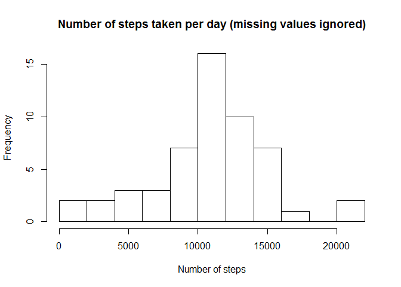
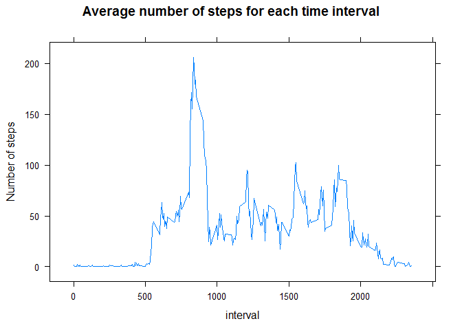
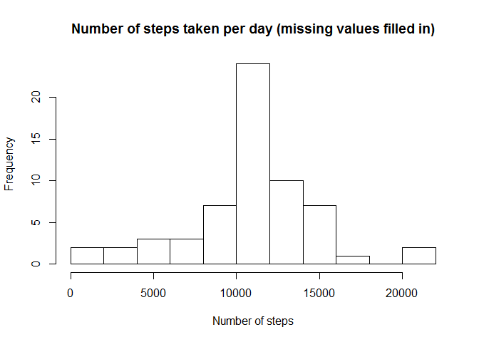
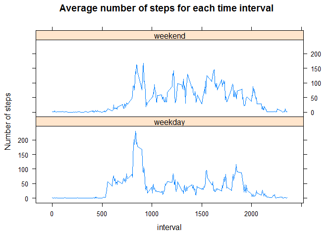

# Reproducible Research: Peer Assessment 1


## Loading and preprocessing the data
Load the required libraries

```r
library(dplyr)
library(lubridate)
library(lattice)
```

Unzip and load the file:

```r
unzip("activity.zip")
dat=read.csv("activity.csv")
```

## What is mean total number of steps taken per day?
Remove the missing values, and compute the total number of steps per day:

```r
dat1=dat[!is.na(dat$steps),]
dat2=summarize(group_by(dat1,date),steps=sum(steps))
```

Make a histogram of the total number of steps taken each day (ignoring missing values):

```r
hist(dat2$steps,10,xlab="Number of steps",main="Number of steps taken per day (missing values ignored)")
```

<!-- -->

Calculate the mean and median of the total number of steps taken per day:

```r
mean(dat2$steps)
```

```
## [1] 10766.19
```

```r
median(dat2$steps)
```

```
## [1] 10765
```


## What is the average daily activity pattern?
Calculate and plot the average number of steps across all days for each time interval (ignoring missing values):

```r
dat3=summarize(group_by(dat1,interval),steps=mean(steps))
xyplot(steps~interval,data=dat3,type="l",ylab="Number of steps",main="Average number of steps for each time interval")
```

<!-- -->

Calculate the interval with the highest average number of steps:

```r
dat3$interval[which.max(dat3$steps)]
```

```
## [1] 835
```


## Imputing missing values

Calculate the number of missing values:

```r
sum(is.na(dat$steps))
```

```
## [1] 2304
```

Fill in the missing values using the average number of steps for the given time interval, and store the result in a new dataset:

```r
dat4=mutate(merge(dat,dat3,by="interval",all.x=T),
            steps=ifelse(is.na(steps.x),steps.y,steps.x))
```

Make a histogram of the total number of steps taken each day, after filling in the missing data:

```r
dat5=summarize(group_by(dat4,date),steps=sum(steps))
hist(dat5$steps,10,xlab="Number of steps",
     main="Number of steps taken per day (missing values filled in)")
```

<!-- -->

Calculate the mean and median of the total number of steps taken per day:

```r
mean(dat5$steps)
```

```
## [1] 10766.19
```

```r
median(dat5$steps)
```

```
## [1] 10766.19
```

Since the missing values are for entire days, filling in the data only adds days with number of steps equal to the daily mean. As a consequence the daily mean is unchanged, and it is unsurprising that the median is now equal to the mean (corresponding to one of the new data points). Also the histograms only differ by the height of the central peak, as expected.


## Are there differences in activity patterns between weekdays and weekends?
Create a new factor variable indicating whether the date is a weekday or weekend day, using the dataset with missing values filled in.

```r
dat6=mutate(dat4,date.type=factor(weekdays(ymd(as.character(dat4$date)))%in%
                                   c("Saturday","Sunday"),
            levels=c(F,T),labels=c("weekday","weekend")))
```

Calculate and plot the average number of steps across all days for each time interval, for both weekdays and weekend days:

```r
dat7=summarize(group_by(dat6,date.type,interval),steps=mean(steps))
xyplot(steps~interval|date.type,data=dat7,layout=c(1,2),type="l",ylab="Number of steps",
       main="Average number of steps for each time interval")
```

<!-- -->


